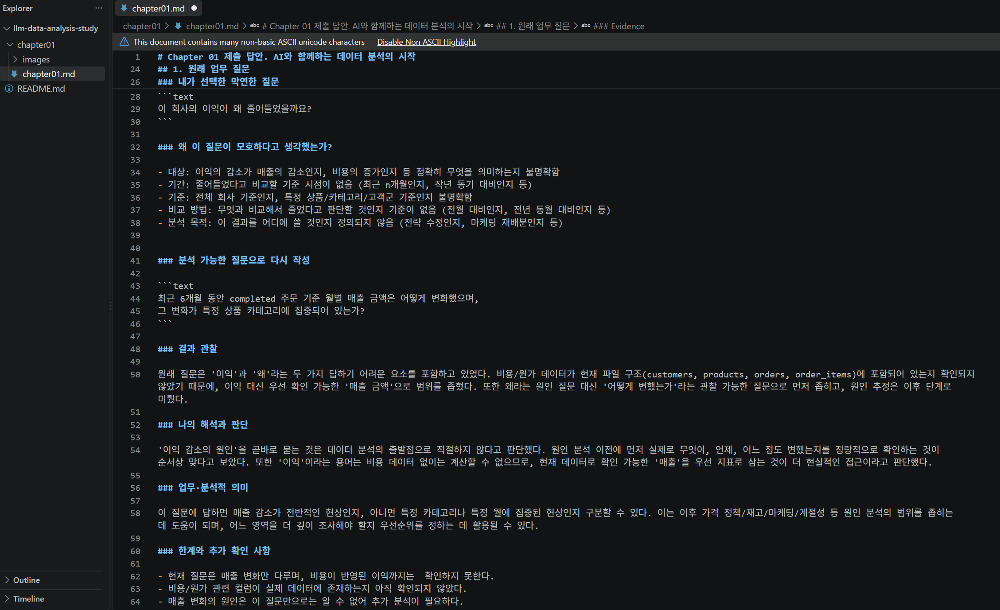
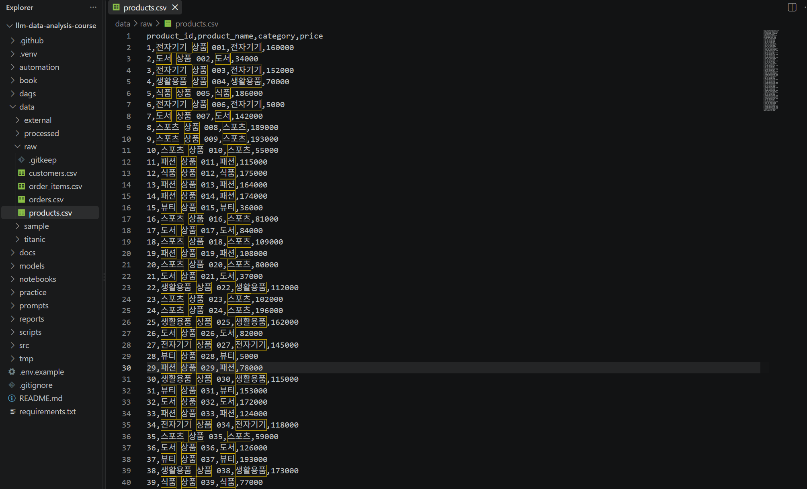
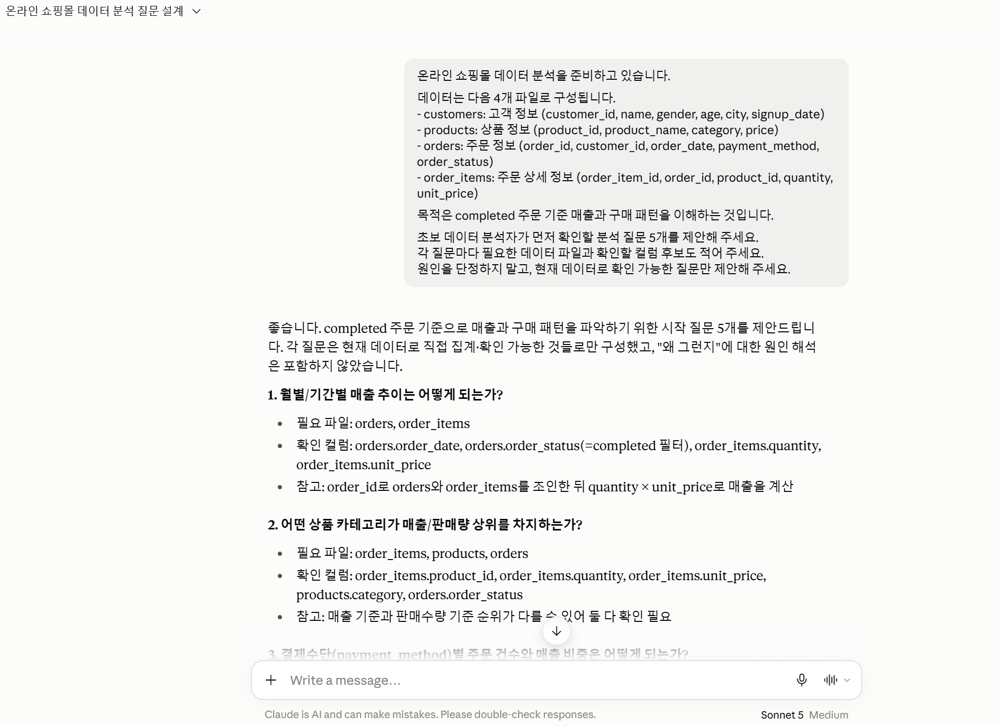
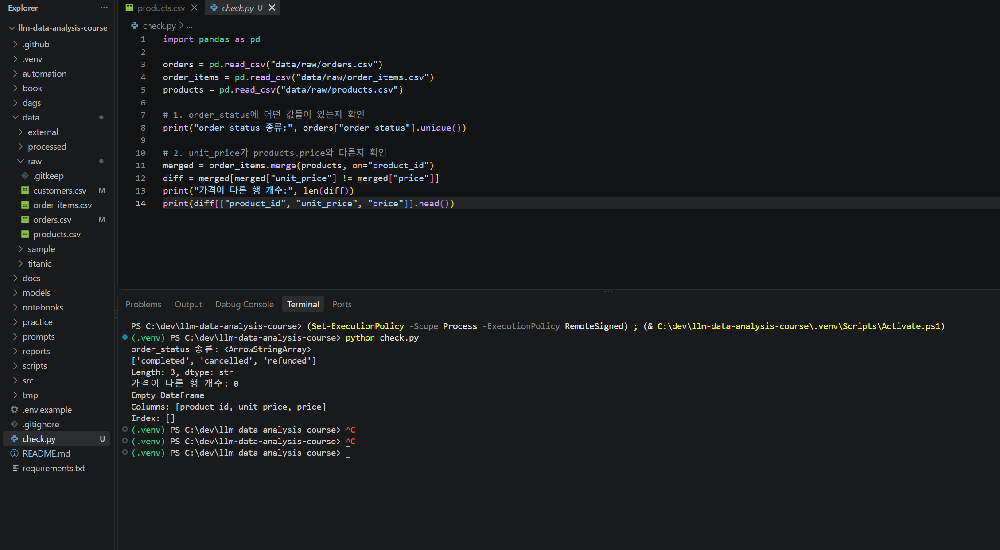
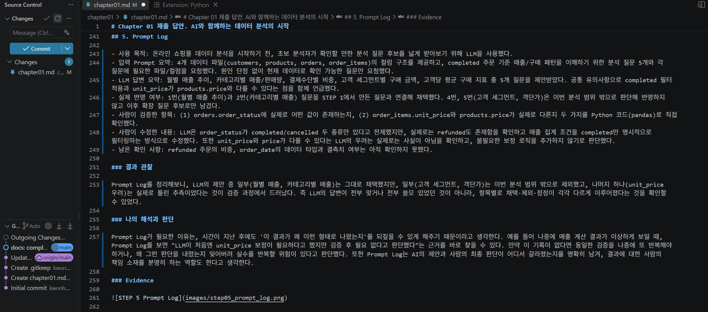

# Chapter 01 제출 답안. AI와 함께하는 데이터 분석의 시작

> 이 파일은 Chapter 01 실습 결과를 정리하여 제출하기 위한 학생용 템플릿입니다.  
> 강사 저장소의 원본 템플릿을 직접 수정하지 말고, 자신의 PC에 복사한 뒤 작성합니다.

---

## 0. 제출 정보

- 이름: 권혁수
- GitHub ID: kwonhyeoksoo
- 개인 저장소명: `llm-data-analysis-study`
- 작성일: 2026-09-13
- 사용한 LLM: Claude Sonnet 5

### 최종 제출 URL

```text
여기에 개인 GitHub 저장소의 chapter01/chapter01.md 파일 URL을 입력하세요.
```

---

## 1. 원래 업무 질문

### 내가 선택한 막연한 질문

```text
이 회사의 이익이 왜 줄어들었을까요?
```

### 왜 이 질문이 모호하다고 생각했는가?

- 대상: 이익의 감소가 매출의 감소인지, 비용의 증가인지 등 정확히 무엇을 의미하는지 불명확함
- 기간: 줄어들었다고 비교할 기준 시점이 없음 (최근 n개월인지, 작년 동기 대비인지 등)
- 기준: 전체 회사 기준인지, 특정 상품/카테고리/고객군 기준인지 불명확함
- 비교 방법: 무엇과 비교해서 줄었다고 판단할 것인지 기준이 없음 (전월 대비인지, 전년 동월 대비인지 등)
- 분석 목적: 이 결과를 어디에 쓸 것인지 정의되지 않음 (전략 수정인지, 마케팅 재배분인지 등)


### 분석 가능한 질문으로 다시 작성

```text
최근 6개월 동안 completed 주문 기준 월별 매출 금액은 어떻게 변화했으며,
그 변화가 특정 상품 카테고리에 집중되어 있는가?
```

### 결과 관찰

원래 질문은 '이익'과 '왜'라는 두 가지 답하기 어려운 요소를 포함하고 있었다. 비용/원가 데이터가 현재 파일 구조(customers, products, orders, order_items)에 포함되어 있는지 확인되지 않았기 때문에, 이익 대신 우선 확인 가능한 '매출 금액'으로 범위를 좁혔다. 또한 왜라는 원인 질문 대신 '어떻게 변했는가'라는 관찰 가능한 질문으로 먼저 좁히고, 원인 추정은 이후 단계로 미뤘다.

### 나의 해석과 판단

'이익 감소의 원인'을 곧바로 묻는 것은 데이터 분석의 출발점으로 적절하지 않다고 판단했다. 원인 분석 이전에 먼저 실제로 무엇이, 언제, 어느 정도 변했는지를 정량적으로 확인하는 것이 순서상 맞다고 보았다. 또한 '이익'이라는 용어는 비용 데이터 없이는 계산할 수 없으므로, 현재 데이터로 확인 가능한 '매출'을 우선 지표로 삼는 것이 더 현실적인 접근이라고 판단했다.

### 업무·분석적 의미

이 질문에 답하면 매출 감소가 전반적인 현상인지, 아니면 특정 카테고리나 특정 월에 집중된 현상인지 구분할 수 있다. 이는 이후 가격 정책/재고/마케팅/계절성 등 원인 분석의 범위를 좁히는 데 도움이 되며, 어느 영역을 더 깊이 조사해야 할지 우선순위를 정하는 데 활용될 수 있다.

### 한계와 추가 확인 사항

- 현재 질문은 매출 변화만 다루며, 비용이 반영된 이익까지는  확인하지 못한다.
- 비용/원가 관련 컬럼이 실제 데이터에 존재하는지 아직 확인되지 않았다.
- 매출 변화의 원인은 이 질문만으로는 알 수 없어 추가 분석이 필요하다.

### Evidence



---

## 2. 질문과 필요한 데이터 연결

### 필요한 데이터 파일

- [ ] `customers.csv`
- [x] `products.csv`
- [x] `orders.csv`
- [x] `order_items.csv`

### 필요한 컬럼 후보

| 파일 | 필요한 컬럼 | 필요한 이유 |
| --- | --- | --- |
| orders.csv | order_id, order_date, order_status | 월별 집계 기준 날짜와 completed 여부를 걸러내기 위해 필요 |
| order_items.csv | order_id, product_id, quantity, unit_price | 주문별 매출 금액을 quantity × unit_price로 직접 계산하기 위해 필요 (금액 컬럼이 따로 없음) |
| products.csv | product_id, category | 카테고리별로 매출을 나눠서 비교하기 위해 필요 |

### 데이터 연결 관계

```text
orders.order_id      ─> order_items.order_id
products.product_id  ─> order_items.product_id
customers.customer_id ─> orders.customer_id (이번 질문에는 직접 사용하지 않음)
```

### 결과 관찰

실제 CSV를 열어 컬럼을 확인한 결과, 4개 파일 모두 예상했던 키(order_id, product_id, customer_id)로 서로 연결 가능하다는 것을 확인했다. 다만 order_items.csv에는 금액이라는 컬럼이 따로 존재하지 않고, quantity와 unit_price 두 컬럼을 곱해서 직접 계산해야 한다는 것을 확인했다. 또한 orders.csv의 order_status에는 실제로 completed, cancelled 값이 존재함을 확인했다. products.csv에는 category 컬럼이 실제로 존재했다. 반면 4개 파일 어디에도 원가, 비용, 매입가에 해당하는 컬럼은 없었다.

### 나의 해석과 판단

이번 질문(월별 completed 매출 변화 및 카테고리별 집중도)은 현재 데이터로 답할 수 있다고 판단했다. 다만 매출 금액은 미리 계산된 컬럼이 없으므로 quantity * unit_price 계산을 직접 수행해야 하며, 이 계산 과정 자체가 분석의 정확성을 좌우하는 지점이라고 판단했다. 또한 원가 컬럼이 전혀 없다는 것을 실제로 확인했으므로, STEP 1에서 이익 대신 '매출'로 질문 범위를 좁힌 판단이 타당했음을 재확인했다.

### 업무·분석적 의미

질문을 실행하기 전에 실제 컬럼을 확인함으로써, "출 감소라는 표현이 실제로는 quantity와 unit_price를 곱한 파생 값이라는 것을 미리 인지할 수 있었다. 이는 이후 분석에서 계산 로직이 잘못되었을 때 원인을 빠르게 추적하는 데 도움이 되며, 이익 분석은 이번 데이터로 불가능하다는 것을 미리 확정해 불필요한 시행착오를 방지할 수 있다.

### 한계와 추가 확인 사항

- order_items.csv에 quantity가 0이거나 unit_price가 결측인 행이 있는지 확인 필요
- orders.csv의 order_status에 completed, cancelled 외 다른 값(예: pending, refunded)이 있는지 전체 목록 확인 필요
- 원가/비용 컬럼이 전혀 없으므로, 이익 관련 질문은 이 데이터셋만으로는 분석이 불가능하며 별도 데이터가 필요하다는 것을 명확히 해야 함
- cancelled 상태인 주문의 order_items도 매출 집계에서 반드시 제외해야 함 (제외 로직을 실제 코드 작성 시 검증 필요)

### Evidence

필요한 경우 관계도 또는 데이터 파일 확인 화면을 첨부하세요.



---

## 3. LLM에게 분석 질문 후보 요청

### 사용 목적

```text
STEP 1에서 만든 질문 외에도 초기 단계에서 놓칠 수 있는 다른 분석 관점이 있는지 확인하고, 분석 아이디어의 폭을 넓히기 위해 LLM을 사용했다.
```

### 사용한 Prompt

```text
온라인 쇼핑몰 데이터 분석을 준비하고 있습니다.

데이터는 다음 4개 파일로 구성됩니다.
- customers: 고객 정보 (customer_id, name, gender, age, city, signup_date)
- products: 상품 정보 (product_id, product_name, category, price)
- orders: 주문 정보 (order_id, customer_id, order_date, payment_method, order_status)
- order_items: 주문 상세 정보 (order_item_id, order_id, product_id, quantity, unit_price)

목적은 completed 주문 기준 매출과 구매 패턴을 이해하는 것입니다.

초보 데이터 분석자가 먼저 확인할 분석 질문 5개를 제안해 주세요.
각 질문마다 필요한 데이터 파일과 확인할 컬럼 후보도 적어 주세요.
원인을 단정하지 말고, 현재 데이터로 확인 가능한 질문만 제안해 주세요.
```

### LLM 답변 요약

LLM의 전체 답변을 그대로 복사하지 말고 핵심 제안 3~5개를 요약하세요.

1. 월별/기간별 completed 매출 추이는 어떻게 되는가 (orders + order_items 조인 후 quantity × unit_price로 계산)
2. 어떤 상품 카테고리가 매출/판매량 상위를 차지하는가 (매출 기준과 판매수량 기준을 각각 확인)
3. 결제수단(payment_method)별 주문 건수와 매출 비중은 어떻게 되는가
4. 고객 세그먼트(성별/연령대/지역)별 구매 금액 차이가 있는가
5. 고객 1인당 평균 구매 횟수와 평균 구매 금액(객단가)은 어느 정도인가

공통 유의사항: 모든 질문에서 order_status='completed' 필터를 먼저 적용해야 하며, order_items.unit_price가 products.price와 다를 수 있으므로(할인 등) 매출 계산 시 order_items.unit_price를 기준으로 삼아야 한다는 점을 지적함.


### 결과 관찰

LLM은 매출 추이, 카테고리 비교, 결제수단 비교, 고객 세그먼트 비교, 고객당 평균 구매 지표까지 총 5개 방향을 제안했다. 모든 질문에 completed 필터 적용을 공통 전제로 명시했고, 원인 단정 표현 (예: "왜 감소했는가")은 포함하지 않았다. 또한 order_items.unit_price와 products.price가 다를 수 있다는 점을 스스로 지적한 것이 특징적이었다.

### 나의 해석과 판단

1번 질문은 STEP 1에서 이미 정의한 내 질문과 거의 동일해서 그대로 채택 가능하다고 판단했다. 2번(카테고리별 매출)도 STEP 1 질문의 후반부인 '카테고리에 집중되는가'와 바로 연결되므로 채택했다.

반면 unit_price와 products.price가 다를 수 있다는 지적은 사실 여부를 실제 데이터로 확인하지 않은 상태의 '가능성' 제기였다. LLM이 실제 데이터를 본 것이 아니라 일반적인 이커머스 상식에 기반해 추측한 내용이므로, 그대로 믿지 않고 직접 두 값을 비교해 검증해야 한다고 판단했다.

4번, 5번(고객 세그먼트, 객단가)은 흥미로운 방향이지만 이번 STEP 1 질문의 범위를 벗어나므로 이번 분석에서는 채택하지 않고 이후 단계의 확장 질문 후보로만 남겨두기로 판단했다.

### 업무·분석적 의미

LLM은 짧은 시간에 여러 분석 방향을 나열해줌으로써 혼자서는 놓칠 수 있는 관점(결제수단별 비교, 객단가 등)을 빠르게 떠올리는 데 도움이 되었다. 다만 이는 아이디어 브레인스토밍 수준의 도움이며, 실제로 어떤 질문을 우선순위로 삼을지는 현재 진행 중인 STEP 1 질문과의 연관성을 기준으로 사람이 직접 선별해야 한다는 것을 재확인했다.

### 한계와 추가 확인 사항

- order_items.unit_price와 products.price가 실제로 다른지 데이터로 직접 비교 검증이 필요하다 (LLM의 추측일 뿐 확인된 사실이 아님)
- LLM이 제안한 5개 질문 모두 'completed 필터를 먼저 적용해야 한다'고 했지만, 실제 order_status 값에 completed/cancelled 외 다른 값(pending 등)이 있는지는 아직 전수 확인하지 않았다.

### Evidence



---

## 4. LLM 제안 검증

LLM 제안 중 하나 이상을 선택해 검토합니다.

| 검증 항목 | 확인 내용 |
| --- | --- |
| 선택한 LLM 제안 | 1번 "월별/기간별 completed 매출 추이는 어떻게 되는가" |
| 필요한 파일 | orders.csv, order_items.csv |
| 필요한 컬럼 | orders.order_date, orders.order_status, order_items.order_id, order_items.quantity, order_items.unit_price |
| 계산 범위 | order_status == 'completed' 인 주문만 포함, 매출 = quantity × unit_price |
| 실제 데이터 확인 필요 여부 | 확인 완료 — order_status 종류와 unit_price vs price 차이를 직접 코드로 검증함 |
| 원인 단정 여부 | 없음 — LLM 제안은 "무엇이 어떻게 변했는가"만 묻고 있어 원인 단정을 포함하지 않음 |
| 최종 판단 | 수정 후 사용 |

### 내가 수정한 내용

```text
LLM은 order_status에 completed와 cancelled만 존재한다고 전제하고 있었지만, 실제로는 refunded 상태도 존재한다는 것을 코드로 확인했다. 따라서 매출 집계 조건을 단순히 'completed만 포함'이 아니라 'completed 이외의 상태(cancelled, refunded)는 명시적으로 제외한다'는 조건으로 더 명확하게 수정했다.

또한 LLM이 제기했던 "unit_price가 products.price와 다를 수 있다"는 우려는 실제 데이터에서 두 값이 정확히 일치함을 확인했으므로, 이 부분에 대한 추가 보정 로직은 필요 없다고 결론 내렸다.
```

### 결과 관찰

orders.csv의 order_status를 실제로 조회한 결과 completed, cancelled, refunded 3가지 값이 존재했다. 이는 LLM이 언급하지 않았던 값이다.
order_items.unit_price와 products.price를 merge하여 비교한 결과, 두 값이 다른 행은 0건이었다. 즉 이번 데이터에서는 상품별 가격이 order_items와 products 양쪽에서 동일하게 기록되어 있었다.

### 나의 해석과 판단

LLM의 제안을 그대로 사용하지 않고 '수정 후 사용'으로 판단한 것에는 두 가지 이유가 있다.

첫째, LLM이 놓친 refunded 상태를 실제 데이터에서 발견했기 때문에, 매출 계산 조건을 order_status에 존재하는 모든 값을 확인한 후 completed만 명시적으로 필터링하는 방식으로 다시 정의해야 한다고 판단했다.

둘째, LLM이 제기했던 unit_price 불일치 우려는 실제로는 사실이 아니었다. 이는 LLM이 일반적인 이커머스 상식(할인 등으로 가격이 달라질 수 있다)에 기반해 추측했을 뿐, 이 프로젝트의 실제 데이터를 본 것이 아니기 때문에 발생한 차이라고 해석했다. 이 경험을 통해 LLM의 제안 중 "~일 수 있다"는 표현은 반드시 실제 데이터로 사실 여부를 확인해야 한다는 것을 다시 확인했다.

### 업무·분석적 의미

만약 LLM 제안을 검증 없이 그대로 사용했다면, refunded 상태의 주문을 매출에서 제외하지 못해 실제보다 매출을 과대 계상하는 오류가 발생했을 수 있다. 반대로 불필요하게 unit_price 보정 로직을 추가로 만들었다면, 존재하지 않는 문제를 해결하려다 시간을 낭비했을 것이다. 이는 LLM의 제안이 '그럴듯하다'는 이유만으로 채택되어서는 안 되며, 실제 데이터 검증이 선행되어야 한다는 것을 보여주는 구체적인 사례라고 판단했다.

### 한계와 추가 확인 사항

- refunded 상태의 주문이 전체 주문 중 몇 건, 몇 %를 차지하는지는 아직 집계하지 않았다. 규모에 따라 분석 결과 해석이 달라질 수 있다.
- order_date의 실제 데이터 타입(문자열/날짜형)과 결측치 여부는 아직 확인하지 못했다.
- 이번 검증은 orders.csv와 order_items.csv, products.csv 3개 파일에 대해서만 이루어졌으며, customers.csv 관련 컬럼(2, 4, 5번 LLM 제안)은 검증하지 않았다.

### Evidence



---

## 5. Prompt Log

- 사용 목적:
- 입력 Prompt 요약:
- LLM 답변 요약:
- 실제 반영 여부:
- 사람이 검증한 항목:
- 사람이 수정한 내용:
- 남은 확인 사항:

### 결과 관찰

LLM 사용 기록에서 어떤 의사결정 과정을 확인할 수 있는지 작성하세요.

### 나의 해석과 판단

Prompt Log를 남기는 것이 왜 필요한지 자신의 말로 작성하세요.

### Evidence



---

## 6. 개인정보와 Secret 보호 확인

다음 항목을 확인합니다.

- [ ] 실제 이름·이메일·전화번호 등 고객 개인정보를 Prompt에 사용하지 않았습니다.
- [ ] API Key를 코드나 Notebook에 직접 작성하지 않았습니다.
- [ ] `.env` 실제 내용을 캡처하거나 업로드하지 않았습니다.
- [ ] GitHub Token, 비밀번호, 내부 URL이 캡처에 보이지 않습니다.
- [ ] 제출 전 이미지까지 다시 확인했습니다.

### 나의 판단

이번 실습에서 어떤 정보는 LLM 또는 Public GitHub에 올리면 안 된다고 판단했는지 작성하세요.

---

## 7. Chapter 01 Notebook 확인

Notebook:

```text
notebooks/ch01_ai_data_analysis_intro.ipynb
```

### 내 환경 상태

- [ ] 아직 환경설정 전이라 Notebook 위치만 확인했습니다.
- [ ] 환경설정이 완료되어 Notebook을 직접 실행했습니다.

### 환경설정 완료 학생만 작성

#### 실행한 코드

```python
from pathlib import Path

import pandas as pd
import numpy as np
import matplotlib.pyplot as plt
import seaborn as sns

DATA_DIR = Path('../data/raw')
sns.set_theme(style='whitegrid')
```

#### 실행 결과

```text
오류 없이 실행되었는지 작성하세요.
```

#### 결과 관찰

실행 결과에서 확인한 사실을 작성하세요.

#### 나의 해석과 판단

현재 Notebook이 본격 분석이 아니라 starter scaffold라는 의미를 자신의 말로 설명하세요.

#### 한계와 추가 확인 사항

Chapter 02 또는 Chapter 03에서 추가로 확인해야 할 내용을 작성하세요.

#### Evidence


> 환경설정 전이라면 이 이미지는 생략할 수 있습니다.

---

## 8. Chapter 01 최종 해석

### 이번 장에서 가장 중요하다고 생각한 내용

```text
자신의 말로 3~5문장 작성하세요.
```

### LLM을 데이터 분석에 사용할 때 가장 조심해야 할 점

```text
자신의 판단을 작성하세요.
```

### 사람과 LLM의 역할 차이

| 항목 | LLM이 도울 수 있는 부분 | 사람이 책임져야 하는 부분 |
| --- | --- | --- |
| 질문 정의 |  |  |
| 데이터 확인 |  |  |
| 코드 작성 |  |  |
| 결과 해석 |  |  |
| 최종 판단 |  |  |

### 다음 Chapter에서 확인하고 싶은 것

```text
이번 장에서 남은 의문이나 Chapter 02~03에서 확인하고 싶은 내용을 작성하세요.
```

---

## 9. 최종 제출 체크리스트

- [ ] 원래 업무 질문과 구체화한 분석 질문을 작성했습니다.
- [ ] 질문에 필요한 데이터 파일과 컬럼 후보를 정리했습니다.
- [ ] LLM Prompt와 답변 요약을 작성했습니다.
- [ ] LLM 제안을 실제 데이터 관점에서 검증했습니다.
- [ ] 각 핵심 STEP의 결과 관찰을 작성했습니다.
- [ ] 각 핵심 STEP의 나의 해석과 판단을 작성했습니다.
- [ ] 업무·분석적 의미를 작성했습니다.
- [ ] 한계와 추가 확인 사항을 작성했습니다.
- [ ] 핵심 실행 Evidence 이미지를 첨부했습니다.
- [ ] 이미지가 Markdown에서 정상 표시됩니다.
- [ ] 개인정보가 없습니다.
- [ ] API Key·Secret·Token이 없습니다.
- [ ] 개인 GitHub 저장소에 업로드했습니다.
- [ ] GitHub에서 Markdown과 이미지가 정상 표시됩니다.
- [ ] 아래 최종 파일 URL이 정상적으로 열립니다.

### 최종 파일 URL

```text
https://github.com/<내-GitHub-ID>/llm-data-analysis-study/blob/main/chapter01/chapter01.md
```

---

## 10. 교수자 확인용 요약

### 수행 상태

- [ ] COMPLETE
- [ ] PARTIAL

### 내가 가장 중요하게 내린 판단 1개

```text
여기에 작성하세요.
```

### 아직 확인이 필요한 내용 1개

```text
여기에 작성하세요.
```
