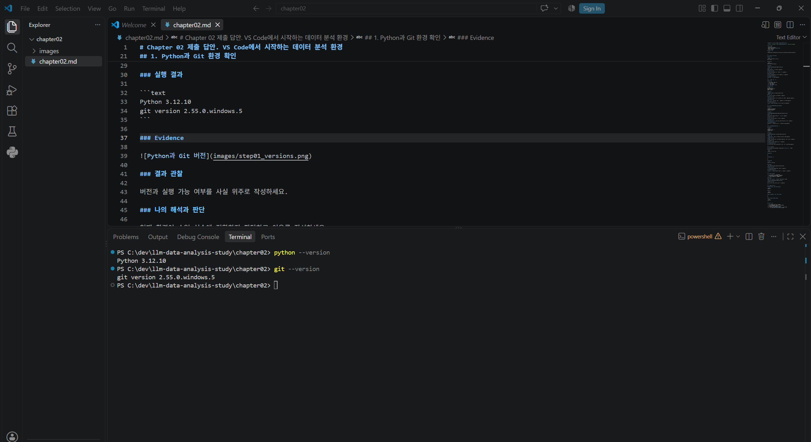
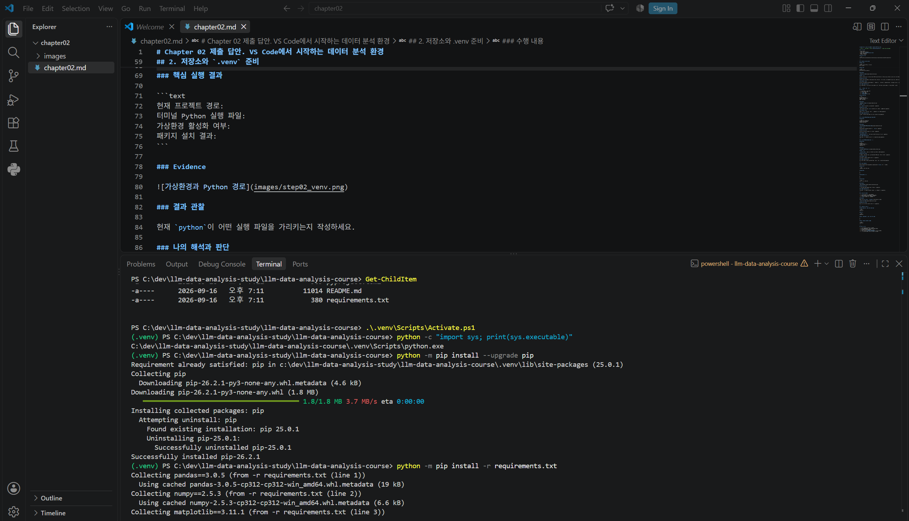
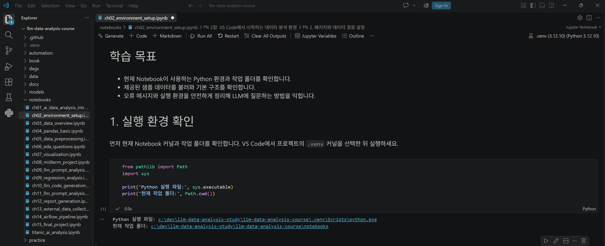
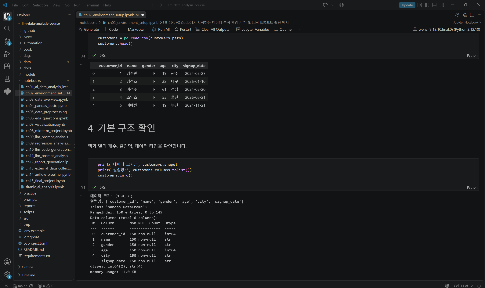
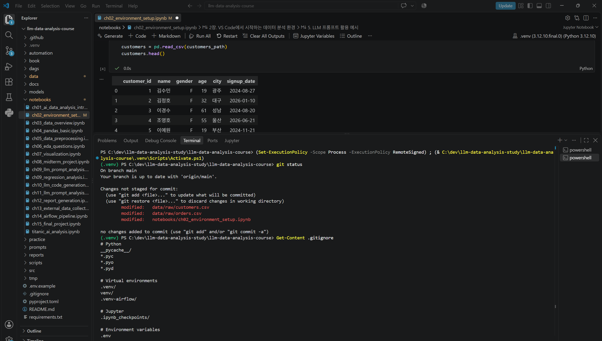

# Chapter 02 제출 답안. VS Code에서 시작하는 데이터 분석 환경

> 최종 파일은 개인 GitHub 저장소의 `chapter02/chapter02.md`로 저장하는 것을 권장합니다.

## 0. 제출 정보

- 이름: 권혁수
- GitHub ID: kwonhyeoksoo
- 개인 저장소: `llm-data-analysis-study`
- 작성일: 2026-09-16
- 운영체제: Windows

### 최종 제출 URL

```text
https://github.com/kwonhyeoksoo/llm-data-analysis-study/blob/main/chapter02/chapter02.md
```

---

## 1. Python과 Git 환경 확인

### 실행 내용

```text
python --version 또는 py --version
git --version
```

### 실행 결과

```text
Python 3.12.10
git version 2.55.0.windows.5
```

### Evidence



### 결과 관찰

python --version과 git --version 명령이 모두 오류 없이 정상적으로 실행되었으며, Python 3.12.10과 Git 2.55.0 버전이 출력되었다.

### 나의 해석과 판단

Python과 Git이 최신 버전으로 정상 설치되어 있어, 이후 공식 저장소 clone과 .venv 가상환경 생성 등 다음 단계를 진행하는 데 문제가 없다고 판단했다.

### 업무·분석적 의미

프로젝트 시작 전에 실행 환경의 버전을 먼저 확인하는 것은, 이후 패키지 호환성이나 버전 관련 오류가 발생했을 때 원인을 좁혀나가기 위한 기초 정보가 되기 때문에 중요하다.

### 한계와 추가 확인 사항

현재는 버전 확인만 했으며, 실제로 프로젝트에서 사용할 특정 패키지들과의 호환성 여부는 아직 확인하지 않았다.

---

## 2. 저장소와 `.venv` 준비

### 수행 내용

- [x] 공식 Public 저장소 clone
- [x] 프로젝트 루트 확인
- [x] `.venv` 생성
- [x] `.venv` 활성화
- [x] `requirements.txt` 설치

### 핵심 실행 결과

```text
현재 프로젝트 경로: C:\dev\llm-data-analysis-study\llm-data-analysis-course
터미널 Python 실행 파일: C:\dev\llm-data-analysis-study\llm-data-analysis-course\.venv\Scripts\python.exe
가상환경 활성화 여부: 활성화됨 ((.venv) 프롬프트 표시 확인)
패키지 설치 결과: requirements.txt의 모든 패키지(pandas, numpy, matplotlib 등) 설치 성공
```

### Evidence



### 결과 관찰

python -c "import sys; print(sys.executable)" 실행 결과,
C:\dev\llm-data-analysis-study\llm-data-analysis-course\.venv\Scripts\python.exe 경로가 출력되어 현재 사용 중인 python이 시스템 전역 Python이 아니라 프로젝트 전용 .venv의 Python임을 확인했다. 또한 requirements.txt에 명시된 pandas, numpy, matplotlib, jupyter 등 모든 패키지가 오류 없이 설치 완료되었다.

### 나의 해석과 판단

터미널 프롬프트에 (.venv)가 표시된 것만으로는 실제로 어떤 Python이 실행되는지 알 수 없기 때문에, sys.executable로 직접 실행 경로를 확인하는 것이 필요하다고 판단했다. 시스템 Python과 프로젝트별 .venv를 분리하면, 프로젝트마다 서로 다른 버전의 패키지를 설치해도 충돌 없이 독립적으로 관리할 수 있다는 점을 확인했다.

### 업무·분석적 의미

다른 사람이 이 프로젝트를 그대로 재실행하려 할 때, requirements.txt와 .venv를 이용하면 동일한 패키지 버전으로 동일한 실행 환경을 재현할 수 있다. 이는 내 컴퓨터에서는 되는데 다른 컴퓨터에서는 안 되는 문제를 줄여준다는 점에서 실무적으로 중요하다.

### 한계와 추가 확인 사항

이번 설치에서는 별도의 오류가 발생하지 않았지만, 운영체제나 Python 버전이 다른 환경에서는 동일한 requirements.txt로도 설치 오류가 발생할 수 있다는 점은 아직 확인하지 못했다.

---

## 3. VS Code 인터프리터와 Jupyter 커널 연결

### 확인 결과

```text
VS Code Python 인터프리터: C:\dev\llm-data-analysis-study\llm-data-analysis-course\.venv\Scripts\python.exe
Notebook sys.executable: c:\dev\llm-data-analysis-study\llm-data-analysis-course\.venv\Scripts\python.exe
Notebook Path.cwd(): c:\dev\llm-data-analysis-study\llm-data-analysis-course\notebooks
```

### Evidence



### 결과 관찰

VS Code에서 선택한 Python 인터프리터 경로와 Notebook에서 sys.executable로 확인한 경로가 완전히 동일했다. 즉, 터미널에서 pip install로 패키지를 설치했던 그 .venv와 Notebook이 실제로 실행에 사용하는 Python이 같은 환경임을 확인했다. Path.cwd()는 notebooks 폴더를 가리켰는데, 이는 노트북 파일이 위치한 경로를 기준으로 작업 디렉터리가 설정된다는 것을 보여준다.

### 나의 해석과 판단

터미널 Python, VS Code 인터프리터, Notebook 커널이 모두 같은 .venv를 가리키고 있으므로 패키지 설치 위치와 실제 실행 환경이 정상적으로 일치한다고 판단했다. 만약 이 세 가지 중 하나라도 다른 Python을 가리켰다면, 터미널에서 설치한 패키지를 Notebook에서 import할 때 ModuleNotFoundError가 발생했을 것이다.

### 업무·분석적 의미

실제 데이터 분석 업무에서는 여러 프로젝트를 동시에 진행하는 경우가 많은데, 이때 인터프리터와 커널이 꼬이면 분명히 설치는 했는데 안 되는 문제가 자주 발생한다. 작업을 시작하기 전에 세 환경(터미널/VS Code/Notebook)이 일치하는지 먼저 확인하는 습관은 이런 문제를 사전에 예방하는 데 도움이 된다.

### 한계와 추가 확인 사항

커널 선택 메뉴에 표시되는 이름만 보고 판단하지 않고 sys.executable로 실제 경로를 직접 확인했다는 점에서 신뢰도 있는 검증이라고 생각한다. 다만 아직 실제로 requirements.txt에 있는 패키지(pandas 등)를 Notebook에서 import해서 정상 동작하는지는 Step 4에서 확인할 예정이다.

---

## 4. 샘플 데이터와 Notebook 실행 검증

### 확인 결과

```text
DATA_DIR 존재 여부: True (c:\dev\llm-data-analysis-study\llm-data-analysis-course\data\raw)
customers.csv 존재 여부: True
customers.shape: (150, 6)
주요 컬럼: customer_id, name, gender, age, city, signup_date
```

### Evidence



### 결과 관찰

scripts/generate_sample_data.py 실행 후 data/raw 폴더에 customers.csv를 포함한 4개의 CSV 파일(customers, products, orders, order_items)이 생성되었다. Notebook에서 pandas로 customers.csv를 읽었을 때 오류 없이 로드되었으며, 150개 행과 6개 컬럼(customer_id, name, gender, age, city, signup_date)으로 구성되어 있음을 확인했다. head() 결과에서도 각 컬럼(고객 ID, 이름, 성별, 나이, 도시, 가입일)에 실제 값이 정상적으로 채워져 있는 것을 확인했다.

### 나의 해석과 판단

이 단계까지 성공했다는 것은 Python 실행 환경, .venv에 설치된 pandas 패키지, VS Code와 연결된 Notebook 커널, 그리고 데이터 파일 경로까지 모든 구성 요소가 정상적으로 하나로 연결되어 있다는 것을 의미한다고 판단했다. 즉 터미널에서 실행한 스크립트로 만든 데이터를, Notebook의 .venv 환경에서 문제없이 읽어올 수 있다는 것이 확인된 것이다.

### 업무·분석적 의미

본격적인 데이터 분석에 들어가기 전에 이런 최소한의 스모크 테스트(smoke test)를 해보는 것은, 나중에 분석 코드 자체의 오류인지 아니면 환경 설정 문제인지를 구분하기 위해 중요하다. 환경이 꼬인 상태에서 분석을 시작하면 사소한 오류의 원인을 찾는 데 오히려 더 많은 시간이 걸릴 수 있다.

### 한계와 추가 확인 사항

이번 단계에서는 데이터가 정상적으로 로드되는지만 확인했을 뿐, 데이터 자체의 품질(결측치, 중복값, 이상치 등)은 아직 검증하지 않았다. 데이터 품질 검증은 Chapter 03 이후에 다룰 예정이다.

---

## 5. 오류 해결 기록

해당 없음.

---

## 6. Secret 보호 확인

- [x] `.env`는 Git 추적 대상이 아닙니다.
- [x] 실제 API Key를 코드에 작성하지 않았습니다.
- [x] 캡처 화면에 Token/비밀번호가 없습니다.
- [x] `.venv`를 Git에 올리지 않습니다.

### Evidence

필요한 경우 `git status`, `.gitignore` 확인 화면을 첨부합니다.



### 나의 해석과 판단

.venv처럼 용량이 크고 개인 PC마다 다를 수 있는 폴더나, .env처럼 API Key 같은 민감정보가 들어갈 수 있는 파일은 애초에 Git 추적 대상에서 제외해야 한다고 판단했다. 이렇게 분리해두면 실수로 커밋하거나 Public 저장소에 올려서 민감정보가 노출되는 사고를 원천적으로 예방할 수 있다. 또한 .venv를 Git에 올리지 않아도, 다른 사람은 requirements.txt만 있으면 동일한 패키지 목록으로 자신의 .venv를 새로 만들 수 있기 때문에 저장소 용량 면에서도 효율적이라는 것을 이해했다.

---

## 7. Chapter 02 최종 회고

### 가장 중요했다고 생각한 환경 설정 1가지

```text
터미널 Python, VS Code Python 인터프리터, Jupyter Notebook 커널을 모두 같은 프로젝트 .venv로 일치시키는 것이 가장 중요했다고 생각한다.

```

### 그 이유

```text
프롬프트에 (.venv)가 표시된다고 해서 바로 정상이라고 넘어가지 않고, python -c "import sys; print(sys.executable)"과 Notebook에서의 sys.executable, 그리고 VS Code Python 인터프리터 경로를 각각 직접 확인하고 서로 비교해보았다. 세 값이 모두 동일한 .venv\Scripts\python.exe 경로를 가리키고 있음을 확인했고, 이를 통해 터미널에서 설치한 패키지를 Notebook에서도 문제없이 사용할 수 있는 환경이 갖춰졌다는 것을 판단할 수 있었다. 이번 실습에서는 별도의 오류 없이 진행되었지만, 만약 이 세 환경 중 하나라도 다른 Python을 가리켰다면 ModuleNotFoundError 같은 문제가 발생했을 것이라는 점에서, 눈에 보이는 표시만 믿지 않고 직접 검증하는 과정 자체가 중요하다고 느꼈다.
```

### 다음 Chapter에서 재사용할 환경 체크 3가지

1. 작업을 시작하기 전에 pwd(또는 Get-Location)로 현재 위치를 먼저 확인하는 습관
2. python -c "import sys; print(sys.executable)"로 실제 사용 중인 Python 경로를 눈으로 직접 확인하는 습관
3. VS Code 인터프리터와 Notebook 커널이 같은 .venv를 가리키는지 매번 확인하는 습관

### 현재 환경의 한계 또는 주의점

```text
이번 Chapter에서는 오류 없이 각 단계를 순조롭게 진행할 수 있었지만, 그만큼 환경 설정 과정에서 발생할 수 있는 다양한 오류 상황(패키지 버전 충돌, 커널 불일치, 경로 문제 등)을 직접 경험해보지는 못했다. 또한 이번 단계에서는 환경이 정상적으로 연결되어 있는지만 확인했을 뿐, 데이터 자체의 품질(결측치, 중복, 이상치 등)은 아직 검증하지 않았다.
```

---

## 최종 제출 체크

- [x] 핵심 Evidence 4~7장을 첨부했습니다.
- [x] 단순 캡처가 아니라 관찰과 판단을 작성했습니다.
- [x] Secret/개인정보가 없습니다.
- [x] GitHub에서 이미지가 정상 표시됩니다.
- [x] 개인 저장소에 `chapter02/chapter02.md`를 업로드했습니다.
- [x] 저장소 URL이 아니라 최종 파일 URL을 제출합니다.